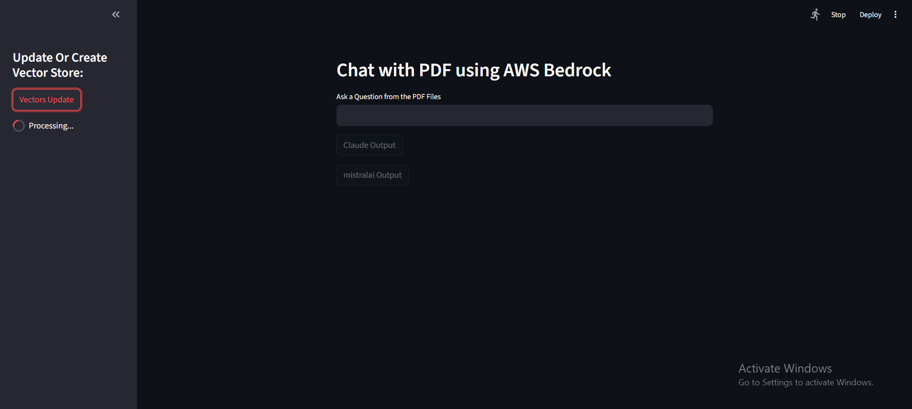
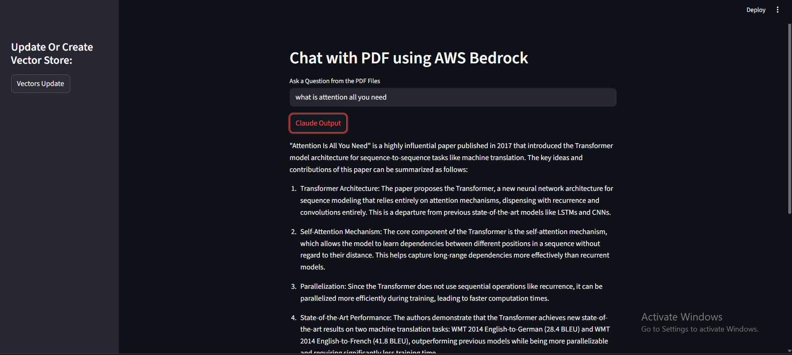
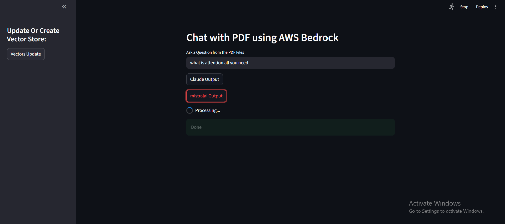
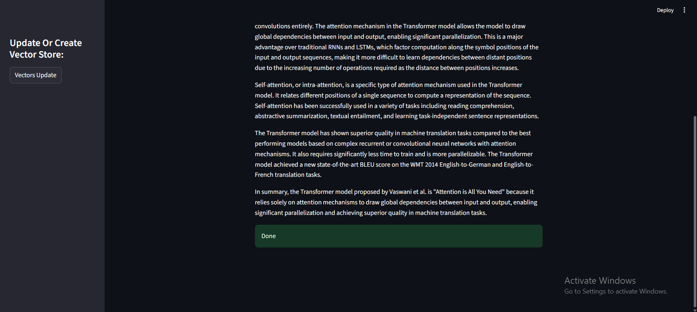

# Chat with PDF (Streamlit + AWS Bedrock RAG)

## Overview
A Streamlit app that loads PDFs from a local `data/` folder (e.g., **Attention** and **YOLO** PDFs), chunks them, builds a **FAISS** vector index using **Amazon Titan Embeddings**, and answers questions using **Bedrock** chat models. You can toggle between **Claude** and **Mistral** from buttons in the UI. The app saves/loads the FAISS index at `faiss_index/`. The repo also includes a Titan **image generation** script that writes PNGs into `output/`.

---

## Screenshots

> Put images in a top-level `screenshots/` folder and use simple names like `01-home.png`, `02-vectors-update.png`, etc.

---

## Features
- **PDF ingestion** from `data/` via `PyPDFDirectoryLoader`.
- **Chunking** with `RecursiveCharacterTextSplitter(chunk_size=2000, chunk_overlap=400)`.
- **Embeddings** via Bedrock **Titan**: `amazon.titan-embed-text-v2:0`.
- **Vector store**: **FAISS**, saved/loaded locally in `faiss_index/`.
- **LLMs** (UI buttons):
  - **Claude** — `anthropic.claude-3-sonnet-20240229-v1:0` (BedrockChat)
  - **Mistral** — `mistral.mistral-7b-instruct-v0:2` (BedrockChat)
- **Retrieval**: `RetrievalQA` (“stuff” chain) with similarity search `k=3`.
- **Prompting**: context-grounded answer; gracefully says “don’t know” when unsure.
- **Titan Image Generation**: separate script writes PNGs into `output/`.

---

## Tools & Technologies
- **Streamlit** (UI)
- **LangChain (community)** — loaders, text splitting, embeddings, FAISS, RAG chains
- **FAISS** — local vector index
- **AWS Bedrock Runtime** via **boto3** (e.g., `us-east-1`)
- **python-dotenv** (optional local env)
- Helper scripts:
  - `titan_image_generator.py` — Bedrock Titan Image native API (outputs to `output/`)
  - `claude_opus_4.py` — Bedrock Claude streaming example
  - `llama3-70b.py` — Bedrock Llama 3 streaming example

---

## How It Works
1. Click **Vectors Update** (sidebar) to load PDFs from `data/`, split to chunks, embed with Titan, and build a local FAISS index at `faiss_index/`.
2. Type your question in the main input field.
3. Choose **Claude Output** or **mistralai Output** — the selected Bedrock model runs retrieval over the FAISS index and returns an answer grounded in your PDFs.

---

## Configuration
- **Region**: set in your Bedrock client (e.g., `us-east-1`).
- **Embeddings**: `amazon.titan-embed-text-v2:0`.
- **Models**: `anthropic.claude-3-sonnet-20240229-v1:0`, `mistral.mistral-7b-instruct-v0:2`.
- **Chunking**: `chunk_size=2000`, `chunk_overlap=400`.
- **Retriever**: similarity search with `k=3`.
- **Environment** (optional): create `.env` with your AWS creds/profile if needed for local dev.

---

## Troubleshooting
- **FAISS load warning**: when loading an index created by yourself, ensure the path is correct and the index wasn’t corrupted.
- **Missing AWS credentials**: confirm your AWS CLI/profile or environment variables are configured.
- **Latency/timeouts**: large PDFs may take time to embed; build vectors once, then reuse the saved index.
- **Image generation not saving**: check write permissions for `output/` and that Bedrock Titan Image is enabled in your account/region.

---

## License
MIT

